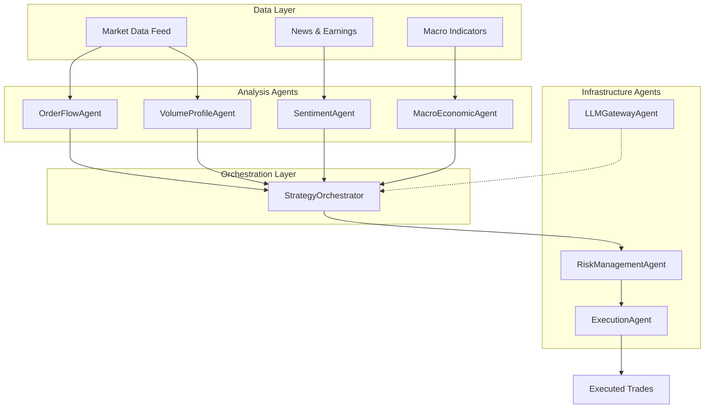
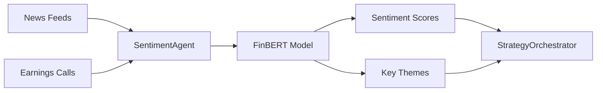
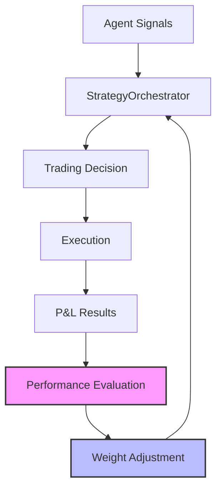
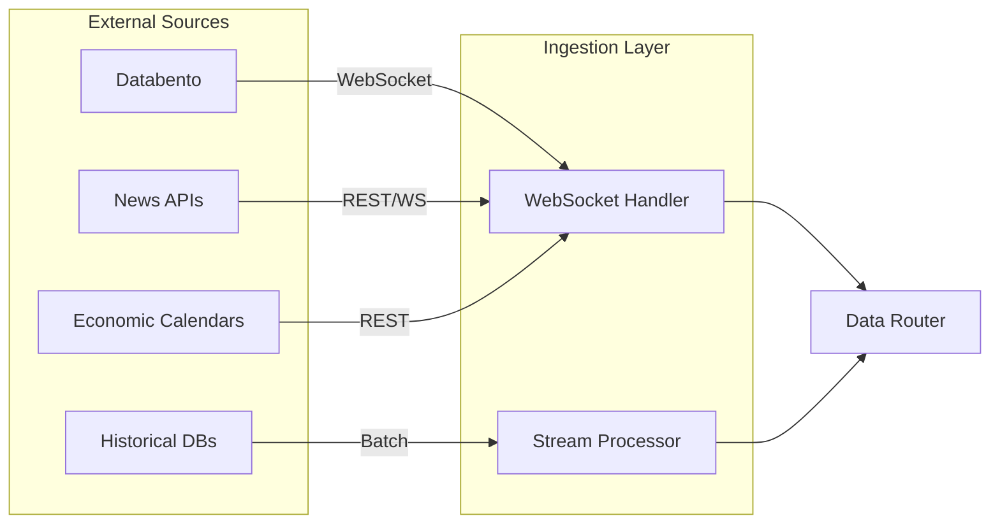
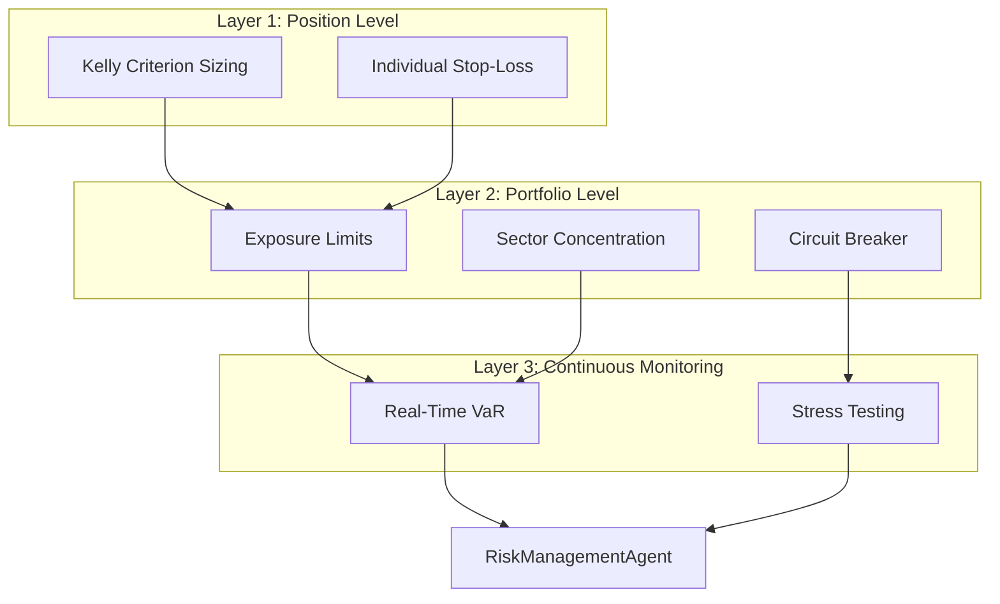
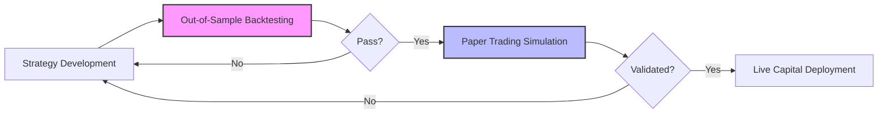

# Wekeza

## A Technical Whitepaper on Multi-Agent Microservices Architecture and Machine Learning Innovations

---

**Version 1.0** | **December 2024**

---

## Table of Contents

1. [Introduction: Bridging the Institutional-Retail Divide](#10-introduction-bridging-the-institutional-retail-divide)
2. [System Architecture: A Microservices and Multi-Agent Paradigm](#20-system-architecture-a-microservices-and-multi-agent-paradigm)
3. [Core Machine Learning Innovations: From Data to Alpha](#30-core-machine-learning-innovations-from-data-to-alpha)
4. [The Operational Data Pipeline: From Ingestion to Execution](#40-the-operational-data-pipeline-from-ingestion-to-execution)
5. [Risk Management and Performance Objectives](#50-risk-management-and-performance-objectives)
6. [Conclusion and Future Work](#60-conclusion-and-future-work)

---

## 1.0 Introduction: Bridging the Institutional-Retail Divide

Modern financial markets are defined by a significant **information and technology asymmetry** between large institutional players and individual retail investors. While institutions deploy sophisticated quantitative models and analyze market microstructure in real-time, retail traders are often confined to strategies based on lagging technical analysis. This disparity in tooling and data access creates a structural disadvantage that is increasingly difficult to overcome.

> [!IMPORTANT]
> The core problem is the retail sector's reliance on conventional chart-based indicators, which often fail to capture the nuanced, high-frequency dynamics of order flow that drive short-term price movements.

**Wekeza** is a full-stack AI trading platform engineered to address this gap directly. It is designed to democratize access to institutional-grade strategies by decomposing the immense complexity of modern trading into a modular, intelligent system. The platform's primary innovation is its **multi-agent microservices architecture**, where specialized software agents collaborate to analyze granular market data, manage risk, and execute trades without human emotional bias.

### Central Hypothesis

The central hypothesis guiding Wekeza is that the integration of **real-time market microstructure analysis** with a **cooperative multi-agent decision layer** can generate consistent, risk-adjusted returns.

The platform's methodology is designed to test this hypothesis against specific performance targets:

| Metric | Target |
|--------|--------|
| **Sharpe Ratio** | > 2.0 |
| **Maximum Drawdown** | < 15% |

This whitepaper provides a technical deep dive into the system's underlying architecture, its core machine learning innovations, and the robust operational framework designed to test this central hypothesis.

---

## 2.0 System Architecture: A Microservices and Multi-Agent Paradigm

The decision to build Wekeza on a **microservices-based, multi-agent architecture** was a strategic one, moving decisively away from monolithic trading algorithms. This design paradigm directly addresses the critical requirements of a modern quantitative system:

- **Scalability** — Independent services can be scaled horizontally based on demand
- **Modularity** — Each agent can be developed, tested, and deployed independently
- **Resilience** — Failure in one service does not cascade to the entire system

By decomposing the trading process into a collection of **12 independent, specialized services**, the platform assigns discrete tasks to dedicated agents, each optimized for its specific function.

### The Wekeza Agent Ecosystem



| Agent | Core Functionality |
|-------|-------------------|
| **OrderFlowAgent** | Constructs Price × Time footprint tensors containing channels for total volume, buy volume, sell volume, trade count, bid depth, and ask depth. Applies the Lee-Ready algorithm to infer trade direction and detect aggressive market participation. |
| **VolumeProfileAgent** | Builds volume profile tensors by organizing trade data into price bins to calculate node intensities, the Volume Point of Control (VPOC), and key value areas. |
| **SentimentAgent** | Performs natural language processing (NLP) on unstructured text from news feeds and earnings calls using the FinBERT model to extract quantitative sentiment scores. |
| **LLMGatewayAgent** | Routes complex reasoning and analysis tasks to the most performance-appropriate and cost-effective Large Language Model (LLM) via the OpenRouter service, optimizing operational costs. |
| **RiskManagementAgent** | Continuously monitors portfolio-wide risk, calculates Value at Risk (VaR) in real-time, and enforces predefined exposure and stop-loss limits. |
| **ExecutionAgent** | Manages the placement of market orders, utilizing smart order routing (SOR) algorithms to minimize transaction slippage and optimize trade execution. |
| **StrategyOrchestrator** | Serves as the **meta-agent** within the 12-agent ecosystem. Aggregates signals from the other 11 specialized agents using a weighted voting system to produce the final, consolidated trading decision. |

### Model Context Protocol (MCP)

A custom **Model Context Protocol (MCP)** governs all inter-agent communication. This specialized protocol was developed to facilitate the efficient and flexible exchange of complex data structures—such as tensors and sentiment scores—between the independent microservices.

> [!NOTE]
> Unlike standard API calls, the MCP is optimized for the low-latency, high-throughput demands of a real-time trading environment, ensuring that agents can coordinate seamlessly without creating data bottlenecks.

### The StrategyOrchestrator: The Terminal Decision Layer

The **StrategyOrchestrator** functions as the terminal decision layer in the architecture. It serves as a meta-agent that aggregates the diverse signals produced by the other 11 agents.

Rather than relying on a single predictive model, it employs a **weighted voting system**. This ensemble methodology provides more robust and reliable decision-making, as the final trade signal is a consensus derived from multiple analytical dimensions—from deep order-flow analysis to macroeconomic trends.

---

## 3.0 Core Machine Learning Innovations: From Data to Alpha

The machine learning capabilities of Wekeza are strategically focused on moving beyond conventional price prediction. The platform's intelligence is designed to analyze granular, high-frequency data to uncover **"latent signals"**—patterns in market activity that are invisible to traditional analysis and the human eye.

This is achieved through a combination of:
- Novel data representation
- Specialized NLP models
- An adaptive learning framework

### 3.1 Tensor-Based Microstructure Analysis

The platform's primary alpha-generating innovation is its ability to transform raw market data into rich, multi-dimensional data structures known as **tensors**. This allows machine learning models to analyze the market's microstructure with a depth comparable to institutional systems.

#### Order-Flow Footprint Tensors

The **OrderFlowAgent** converts tick data into Price × Time grids. These tensors are not simple charts; they are complex data objects containing multiple input channels:

```
┌─────────────────────────────────────────────────────────────┐
│                  FOOTPRINT TENSOR STRUCTURE                  │
├─────────────────────────────────────────────────────────────┤
│  Channel 1: Total Volume                                     │
│  Channel 2: Buy Volume                                       │
│  Channel 3: Sell Volume                                      │
│  Channel 4: Trade Count                                      │
│  Channel 5: Bid Depth                                        │
│  Channel 6: Ask Depth                                        │
└─────────────────────────────────────────────────────────────┘
              ↓
    ┌─────────────────┐
    │   Price × Time  │
    │      Grid       │
    │    (Tensor)     │
    └─────────────────┘
```

#### Lee-Ready Algorithm Integration

To further enrich the footprint tensors, the system integrates the **Lee-Ready algorithm** to infer trade direction. By classifying each trade as buyer-initiated or seller-initiated based on its price relative to the bid-ask spread, the model can accurately detect aggressive market participation.

> [!TIP]
> This classification is critical—it allows the system to distinguish between passive liquidity and aggressive, directional market participation. This is a **latent signal** of impending price movement that is entirely absent from conventional volume indicators.

### 3.2 Natural Language Processing (NLP)

To incorporate a layer of fundamental analysis, the platform automates the processing of unstructured text data.



The **SentimentAgent** utilizes **FinBERT**, a Large Language Model specifically pre-trained on a massive corpus of financial text. This agent processes:

- Real-time news feeds
- Corporate earnings call transcripts

It extracts sentiment scores and identifies key themes that may impact asset prices, automating a critical component of analysis that is typically manual and time-consuming.

### 3.3 Dynamic Feedback Loop

The Wekeza system is designed to **learn and adapt** to changing market conditions through a dynamic feedback loop that adjusts the influence of each agent over time.



The voting weight assigned to each agent by the StrategyOrchestrator is continuously updated based on:
- Recent profitability
- Signal accuracy

This mechanism, a form of **reinforcement learning**, allows the system to:
- ✅ Automatically amplify signals from high-performing agents
- ✅ Reduce influence of agents struggling in the current market regime

### 3.4 Cost-Optimization Innovation

Recognizing the high operational costs associated with advanced AI, the platform incorporates a novel efficiency mechanism. The **LLMGatewayAgent** uses OpenRouter to dynamically select the most appropriate LLM for a given reasoning task.

| Task Complexity | Model Selection | Cost Impact |
|-----------------|-----------------|-------------|
| Simple queries | Lightweight models | Low |
| Complex reasoning | Premium models | High |
| Standard analysis | Balanced models | Medium |

> [!NOTE]
> Instead of defaulting to a single, expensive model, queries are routed to the optimal model based on a balance of performance requirements and computational cost. This demonstrates a pragmatic focus on real-world operational viability.

---

## 4.0 The Operational Data Pipeline: From Ingestion to Execution

A clearly defined and robust data pipeline is the lifeblood of any high-frequency trading system. The architecture of Wekeza is built around a systematic, end-to-end data flow that ensures:

- **Integrity** — Data accuracy and consistency at every stage
- **Low Latency** — Minimal delay from market event to system response
- **Accurate Processing** — Precise transformation and analysis

### 4.1 Primary Data Inputs

The system ingests a diverse range of data types through a dedicated ingestion layer that streams information in real-time via **WebSocket connections** from providers like Databento.



| Data Type | Description | Usage |
|-----------|-------------|-------|
| **Market Data** | Real-time, tick-level data (price, volume, timestamp) | Primary input for microstructure analysis |
| **Order Book Data** | Top-of-book and full-depth updates | Complete picture of market liquidity |
| **Unstructured Text** | News feeds & earnings transcripts | NLP analysis by SentimentAgent |
| **Macroeconomic Data** | Economic indicators & global events | Broader market context |
| **Historical Data** | Minimum 5 years of historical data | Rigorous backtesting & validation |

### 4.2 Internal Data Transformation

Once ingested, specialized agents immediately process and transform the raw data into analytical formats suitable for machine learning models.

```
┌──────────────────┐     ┌───────────────────────┐
│    Raw Ticks     │────▶│    OrderFlowAgent     │────▶ Footprint Tensors
└──────────────────┘     └───────────────────────┘

┌──────────────────┐     ┌───────────────────────┐
│   Trade Data     │────▶│  VolumeProfileAgent   │────▶ Volume Profile Tensors
└──────────────────┘     └───────────────────────┘

┌──────────────────┐     ┌───────────────────────┐
│  Unstructured    │────▶│   SentimentAgent      │────▶ Sentiment Scores
│      Text        │     └───────────────────────┘
└──────────────────┘
```

> [!IMPORTANT]
> This crucial transformation step converts noisy, unstructured market data into the rich, feature-engineered inputs that drive the platform's analytical engines.

### 4.3 System Outputs

The platform's processing pipeline culminates in a set of clear, actionable outputs:

| Output | Description |
|--------|-------------|
| **Trading Signals** | High-conviction signals (Buy, Sell, Hold) from StrategyOrchestrator based on aggregated agent votes |
| **Executed Trades** | Market orders routed intelligently by ExecutionAgent to minimize slippage |
| **Risk Metrics** | Real-time VaR calculations, portfolio exposure levels, automated stop-loss triggers |
| **Dashboard Visualization** | React-based UI showing operational status, active positions, and KPIs |

---

## 5.0 Risk Management and Performance Objectives

> [!WARNING]
> In quantitative trading, superior alpha generation is meaningless without a disciplined and systematic approach to risk management.

The architecture of Wekeza integrates a **multi-layered framework** designed to preserve capital and ensure that the pursuit of performance targets remains within predefined risk tolerance levels.

### 5.1 Multi-Layered Risk Management System

The platform employs a **defense-in-depth** strategy for risk control, with several automated safeguards operating in parallel:



#### 1. Position Sizing
The system utilizes the **Kelly criterion** to determine optimal position sizes, applying a conservative fraction (e.g., half-Kelly) to prevent over-leveraging and reduce the risk of ruin.

#### 2. Exposure Limits
Strict maximum exposure limits are enforced at both the individual asset and sector levels, preventing excessive concentration in any single position or market segment.

#### 3. Stop-Losses
Automated stop-losses are implemented at **two levels**:
- **Trade Level**: Tight stop-loss for each individual trade
- **Portfolio Level**: "Circuit breaker" stop-loss to protect against catastrophic market events

#### 4. Real-Time Monitoring
The **RiskManagementAgent** continuously monitors Value at Risk (VaR) and conducts regular stress tests based on historical market shocks to ensure portfolio resilience under adverse conditions.

### 5.2 Performance Targets and Evaluation

The success of the Wekeza platform is measured against a clear set of quantitative performance objectives:

| Objective | Target | Rationale |
|-----------|--------|-----------|
| **Sharpe Ratio** | > 2.0 | Strong risk-adjusted returns |
| **Maximum Drawdown** | < 15% | Capital preservation |

#### Evaluation Methodology

Performance is validated through two rigorous phases:



1. **Phase 1: Backtesting**
   - Extensive out-of-sample testing
   - Historical data span: **2015–2023**
   - Validation of all trading strategies

2. **Phase 2: Paper Trading**
   - Real-time simulation with live market data
   - Confirmation of efficacy in live environment
   - No capital at risk

> [!CAUTION]
> Capital is only committed after successful completion of both validation phases.

---

## 6.0 Conclusion and Future Work

**Wekeza** represents a significant step forward in democratizing sophisticated trading technology. Its core technical differentiators are:

| Innovation | Impact |
|------------|--------|
| **Multi-Agent Microservices Architecture** | Scalable, robust, and operationally efficient system |
| **Tensor-Based Microstructure Analysis** | Institutional-grade analytical power |
| **Dynamic Feedback Loop** | Adaptive learning and self-optimization |
| **Cost-Optimized LLM Gateway** | Real-world operational viability |

By decomposing the complex challenge of trading into specialized, collaborative agents, the platform moves beyond the limitations of monolithic algorithms and introduces a **new paradigm for AI-driven financial analysis**.

### Value Proposition

The platform's ultimate value proposition is to **bridge the technological and informational gap** that separates retail traders from institutional firms. By providing access to advanced quantitative strategies powered by deep data analysis and machine learning, Wekeza aims to level the playing field and empower a broader audience of market participants.

### Future Development Roadmap

```mermaid
gantt
    title Wekeza Development Roadmap
    dateFormat  YYYY-Q
    section Market Expansion
    Multi-Asset Classes           :2025-Q1, 2025-Q2
    New Market Instruments        :2025-Q2, 2025-Q3
    section Data Enhancement
    Alternative Data Integration  :2025-Q2, 2025-Q4
    Enhanced Signal Diversity     :2025-Q3, 2025-Q4
    section Innovation
    DeFi Applications             :2025-Q3, 2026-Q1
    Advanced Agent Architectures  :2025-Q4, 2026-Q2
```

Key development initiatives include:

- **Market Expansion**: Broadening the universe of tradable assets to new markets and instruments
- **Data Enhancement**: Integrating alternative datasets to enhance signal diversity
- **DeFi Innovation**: Exploring novel applications of the multi-agent architecture in the rapidly evolving domain of decentralized finance (DeFi)

---

<div align="center">

**Wekeza** — *Democratizing Institutional-Grade Trading Intelligence*

---

*© 2024 Wekeza. All rights reserved.*

</div>
